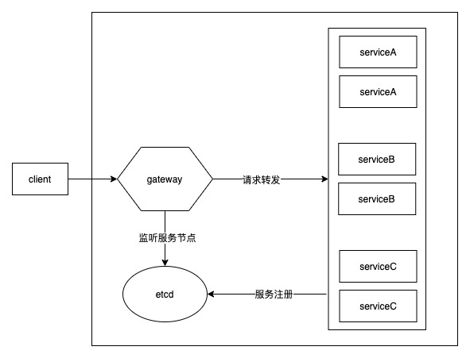
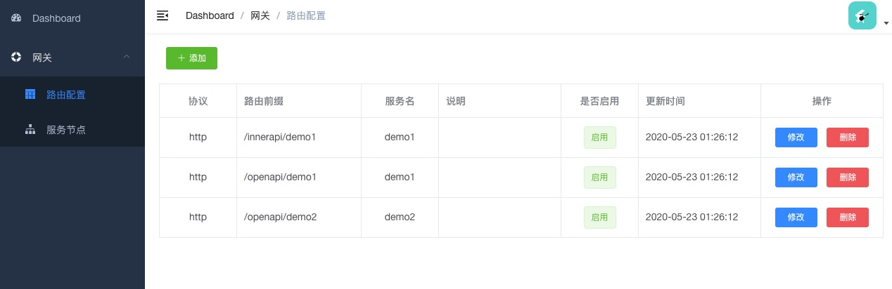
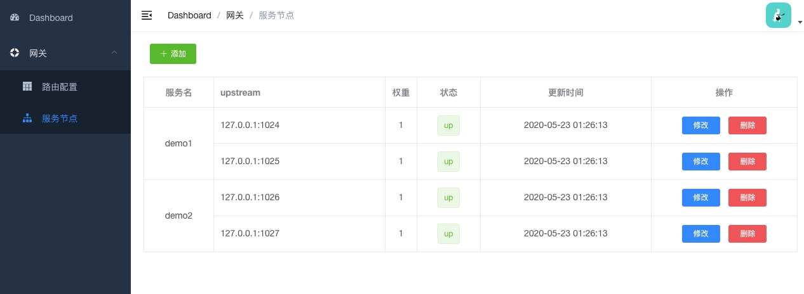

# ws-cloud-gateway

基于 openresty + etcd 实现的轻量级网关服务

- gateway: <https://github.com/tech-microworld/ws-cloud-gateway>
- dashboard: <https://github.com/tech-microworld/ws-cloud-admin>

目前市面上已经有很多网关组件，ws-cloud-gateway 的定位是比更加轻量，只保留在实践中经常使用到的组件，同时可以自定义插件，针对不用业务，定制化个性功能。

项目中参考了 [incubator-apisix](https://github.com/apache/incubator-apisix)，同时有部分代码直接引用了apisix源码。

-  Gitter 讨论组
- [使用文档](https://tech-microworld.github.io/ws-cloud/gateway/)

## 为什么选择 ws-cloud-gateway

1. 高性能：底层使用 nginx 异步事件驱动的网络通信模型
2. 轻量、灵活：将多个微服务组件整合到一起，对服务器开销小（节省服务器成本），适合初创业务，同时后期业务规模扩大后也容易调整
3. 上手简单学习曲线低，支持自定义插件，可灵活定制个性化功能
4. 上游服务节点使用etcd管理，可以通过推模式更新节点配置
5. 无需重启服务，可实时修改参数配置
6. 支持控制面板管理

## 整体架构

服务启动时，将自己的节点信息注册到etcd，包括：服务名称、ip、端口

网关服务从 etcd 监听服务节点信息，保存到缓存中，从客户端请求的url中提取服务名称，通过服务名称查找节点信息，将请求转发到后端服务

## todo

- [x] 服务发现，动态路由
- [x] 自动生成 requestId，方便链路跟踪
- [x] 控制面板
- [x] gRPC 代理
- [ ] 动态ip防火墙
- [ ] 限流器
- [ ] 用户登录认证
- [ ] 接口协议加解密
- [ ] 统一配置管理

## 控制面板

## 鸣谢

- [incubator-apisix](https://github.com/apache/incubator-apisix)

